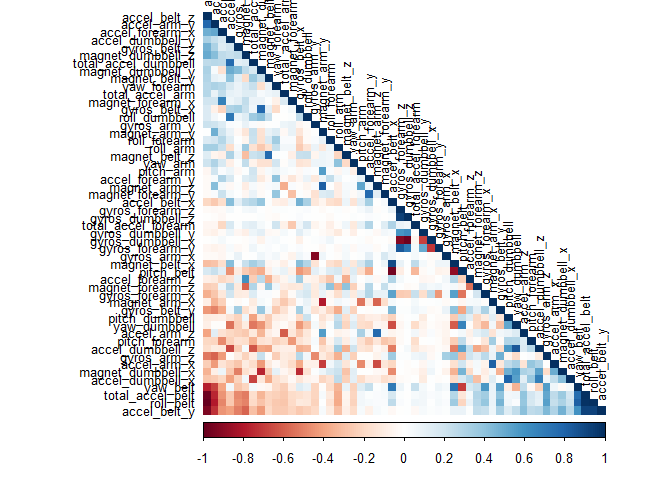

Practical machine Learning Course Project
================
Shounak Shastri
29/05/2020

## Background

Using devices such as Jawbone Up, Nike FuelBand, and Fitbit it is now
possible to collect a large amount of data about personal activity
relatively inexpensively. These type of devices are part of the
quantified self movement – a group of enthusiasts who take measurements
about themselves regularly to improve their health, to find patterns in
their behavior, or because they are tech geeks. One thing that people
regularly do is quantify how much of a particular activity they do, but
they rarely quantify how well they do it.

The goal of this project is to use data from accelerometers on the belt,
forearm, arm, and dumbell of 6 participants. They were asked to perform
barbell lifts correctly and incorrectly in 5 different ways. More
information is available from the website here:
<http://web.archive.org/web/20161224072740/http:/groupware.les.inf.puc-rio.br/har>
(see the section on the Weight Lifting Exercise Dataset)

## Initial Set-up

### Downloading the Required Data

``` r
setwd("C:\\Users\\Intel\\Documents\\Practical Machine Learning Course Project")

# Download Training Data
if(!file.exists("pml-training.csv"))
{
  download.file("https://d396qusza40orc.cloudfront.net/predmachlearn/pml-training.csv",
                "pml-training.csv",
                method = 'curl')
}
trainingData <- read.csv("pml-training.csv", na.strings = c("NA", ""))

# Download Test Data
if(!file.exists("pml-testing.csv"))
{
  download.file("https://d396qusza40orc.cloudfront.net/predmachlearn/pml-testing.csv",
                "pml-testing.csv",
                method = 'curl')
}
testData <- read.csv("pml-testing.csv")
```

### Basic Data Exploration

We first check the size of the training data.

``` r
dim(trainingData)
```

    ## [1] 19622   160

The training data has 160 columns which would result in 160 predictors.
Let us check the summary of the columns to get an idea about what all
the columns contain. This step can be helpful in deciding whether we can
remove any columns from our data to speed up the training process.

``` r
# Commented to save space as it displays the details of 160 columns. It is 
# advised to uncomment this line in order to check the data for NAs.

# str(trainingData)
```

### Data Cleaning

Now that we know what the data looks like, we can see that the first
seven columns would not be useful in prediction. So we can remove the
first 7 columns.

``` r
trainingData <- trainingData[, -c(1:7)]
testData <- testData[, -c(1:7)]
dim(trainingData)
```

    ## [1] 19622   153

Removing columns with zero varience.

``` r
library(caret)
```

    ## Warning: package 'caret' was built under R version 3.6.3

    ## Loading required package: lattice

    ## Loading required package: ggplot2

    ## Warning: package 'ggplot2' was built under R version 3.6.3

``` r
NV <- nearZeroVar(trainingData)
trainingData <- trainingData[, -NV]
testData <- testData[, -NV]
dim(trainingData)
```

    ## [1] 19622   111

From the exploration step, we can see that some of the columns have NA
values. We will check the data for columns which have lot of NA values
and remove them. This will make the analysis easier. Also we need to
make sure that when we remove any column from the training set, that
column should be removed from the test set also. Otherwise it might
result in wrong predictions or errors.

``` r
colsWithNA <- sapply(trainingData, function(x) mean(is.na(x))) > 0.95
trainingData <- trainingData[, colsWithNA == FALSE]
testData <- testData[, colsWithNA == FALSE]

dim(trainingData)
```

    ## [1] 19622    53

Before splitting the training data into training and validation set, let
us check the if we can further reduce the number of variables by
applying PCA. We will check the training set variables to see if they
have a high correlation.

``` r
library(corrplot)
```

    ## Warning: package 'corrplot' was built under R version 3.6.3

    ## corrplot 0.84 loaded

``` r
corMatrix <- cor(trainingData[, -53])
```

It can be seen from the correlation plot shown in Appendix that very few
columns are display a high correlation. Therefore we can skip using PCA.

The correlation on the diagonal elements can be ignored as they
represent the correlations with themselves.

### Creating the Validation Set

Now, let us create a Validation set for the training data to validate
the model. The validation set can be created by partitioning 30% of our
training data.

``` r
set.seed(5) # For reproducability

inTrain  <- createDataPartition(trainingData$classe, p=0.7, list=FALSE)
trainingSet <- trainingData[inTrain, ]
validationSet  <- trainingData[-inTrain, ]
dim(trainingSet)
```

    ## [1] 13737    53

``` r
dim(validationSet)
```

    ## [1] 5885   53

Now we are ready to train models using our data.

## Model fitting

We are going to train a Random Forest model using the `trainingSet` and
validate it on the `validationSet`. If the accuracy is low, then we can
either tune it or check a different model.

We are going to use the k-fold Cross Validation to tune our model with
`k = 5`. The reason for choosing `k = 5` can be noted here:

“…there is a bias-variance trade-off associated with the choice of k (…)
one performs k-fold cross-validation using k = 5 or k = 10, as these
values have been shown empirically to yield test error rate estimates
that suffer neither from excessively high bias nor from very high
variance.”

*- An Introduction to Statistical Learning, 2013*

``` r
# library(randomForest)
control <- trainControl(method="cv", 5)
modelFit <- train(classe ~ .,
                 data=trainingSet,
                 method="rf",
                 trControl=control,
                 ntree=250)
modelFit
```

    ## Random Forest 
    ## 
    ## 13737 samples
    ##    52 predictor
    ##     5 classes: 'A', 'B', 'C', 'D', 'E' 
    ## 
    ## No pre-processing
    ## Resampling: Cross-Validated (5 fold) 
    ## Summary of sample sizes: 10989, 10990, 10990, 10990, 10989 
    ## Resampling results across tuning parameters:
    ## 
    ##   mtry  Accuracy   Kappa    
    ##    2    0.9904637  0.9879358
    ##   27    0.9900269  0.9873828
    ##   52    0.9803450  0.9751310
    ## 
    ## Accuracy was used to select the optimal model using the largest value.
    ## The final value used for the model was mtry = 2.

The model summary shows an accuracy of 0.99 (99%). This accuracy is high
enough that we can use this model for validation and there is no need to
train using a different modelling technique.

Random Forest is a CPU intensive algorithm. I tried training the model
with different values of `ntree` and found 200 to be acceptable in terms
of the time required to train the model. `ntree = 175` results in an
accuracy of approximately 98.8%, which is quite high too. So for
reducing the time and CPU loads, this value is also a valid choice.
`ntree = 250` takes longer to train and the accuracy is 99.08% which is
a very small increase. So I have used `ntree = 200` as it gives an
adequate accuracy.

Now we check the model on the Validation set

``` r
modelValidation <- predict(modelFit, validationSet)
confusionMatrix(validationSet$classe, modelValidation)
```

    ## Confusion Matrix and Statistics
    ## 
    ##           Reference
    ## Prediction    A    B    C    D    E
    ##          A 1672    2    0    0    0
    ##          B   12 1123    4    0    0
    ##          C    0    8 1017    1    0
    ##          D    0    0   12  952    0
    ##          E    0    0    0    2 1080
    ## 
    ## Overall Statistics
    ##                                          
    ##                Accuracy : 0.993          
    ##                  95% CI : (0.9906, 0.995)
    ##     No Information Rate : 0.2862         
    ##     P-Value [Acc > NIR] : < 2.2e-16      
    ##                                          
    ##                   Kappa : 0.9912         
    ##                                          
    ##  Mcnemar's Test P-Value : NA             
    ## 
    ## Statistics by Class:
    ## 
    ##                      Class: A Class: B Class: C Class: D Class: E
    ## Sensitivity            0.9929   0.9912   0.9845   0.9969   1.0000
    ## Specificity            0.9995   0.9966   0.9981   0.9976   0.9996
    ## Pos Pred Value         0.9988   0.9860   0.9912   0.9876   0.9982
    ## Neg Pred Value         0.9972   0.9979   0.9967   0.9994   1.0000
    ## Prevalence             0.2862   0.1925   0.1755   0.1623   0.1835
    ## Detection Rate         0.2841   0.1908   0.1728   0.1618   0.1835
    ## Detection Prevalence   0.2845   0.1935   0.1743   0.1638   0.1839
    ## Balanced Accuracy      0.9962   0.9939   0.9913   0.9972   0.9998

The validation accuracy is 99.32% which is similar to the training
accuracy. This indicates that the model is not overfitted and can be
used on the test data.

### Evaluating the Test Data

``` r
modelTest <- predict(modelFit, testData)
modelTest
```

    ##  [1] B A B A A E D B A A B C B A E E A B B B
    ## Levels: A B C D E

## Appendix

The correlation Plot is as shown below

``` r
corrplot(corMatrix, order = "FPC", method = "color", type = "lower", 
         tl.cex = 0.8, tl.col = rgb(0, 0, 0))
```

<!-- -->
